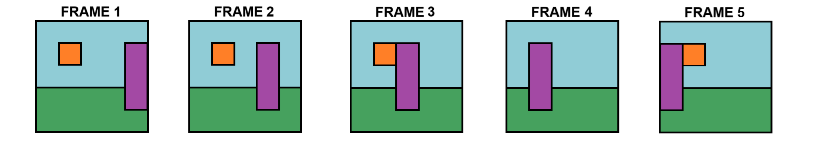
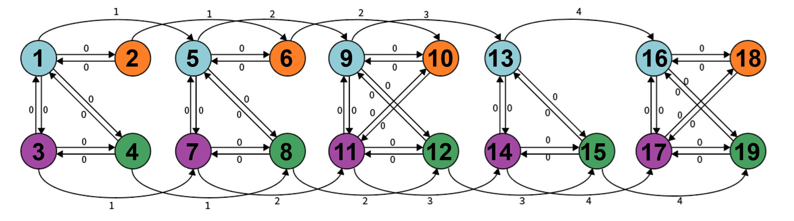
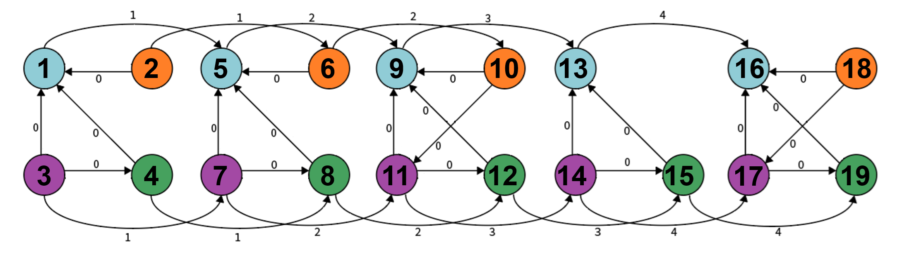
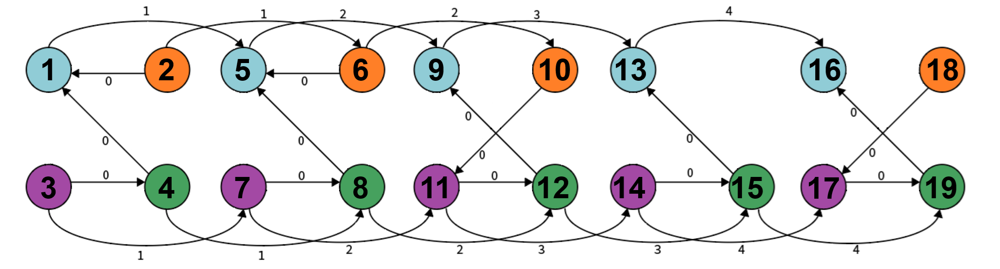

# Classificação de Vídeos Baseada em Grafos Temporais

## 📄 Sobre o Projeto

Este repositório implementa um pipeline leve para análise e classificação de vídeos utilizando grafos temporais. Ao contrário de abordagens baseadas em redes neurais profundas, que requerem grande poder computacional, este projeto propõe uma representação mais enxuta e eficiente, capaz de manter alta acurácia mesmo com forte redução estrutural.

## 🧰 Metodologia

Cada vídeo é transformado em um grafo temporal por meio das seguintes etapas:

1. **Extração de Frames**: Os quadros do vídeo são extraídos sequencialmente.
2. **Segmentação (DISF)**: Cada frame é segmentado em regiões (supervoxels).
3. **Grafo Temporal**:

   * Os supervoxels tornam-se **nós**.
   * **Arestas espaciais** são adicionadas entre regiões adjacentes.
   * **Arestas temporais** conectam regiões correspondentes em frames consecutivos, com cálculo de fluxo máximo para garantir robustez.

### ✏️ Processamento do Grafo

* **Vídeo**:

    

* **Grafo Completo**: Com todas as relações geradas.

    

* **Grafo Acíclico**: Arestas são direcionadas com base na área das regiões para remover ciclos.

  

* **Grafo com Redução Transitiva**: Arestas redundantes são eliminadas mantendo a conectividade essencial.

  

## 🤖 Classificação

Os grafos são vetorizados e classificados utilizando duas abordagens baseadas em kernels:

* **Graphlet Kernel**: Foca em subestruturas locais.
* **Weisfeiler-Lehman Kernel**: Identifica padrões hierárquicos.

## 📊 Resultados

A metodologia foi testada em três conjuntos:

* **ConjuntoMatriz**: Vídeos sintéticos simples. Acurácia > 95% mesmo com redução.
* **ConjuntoKTH**: Recorte com "walking" e "handwaving". Graphlet manteve \~98,6% após eliminação de meio milhão de arestas.
* **ConjuntoColoracao**: Frames coloridos manualmente. Confirmou que a qualidade da segmentação impacta a performance.

## 🚀 Futuro

* Explorar segmentadores mais robustos.
* Avaliar em outros datasets de ação.
* Integrar novos kernels para reconhecimento de padrões complexos.

## ⚙️ Execução

As instruções detalhadas para execução do código estão no arquivo [`howToCompile.md`](howToCompile.md).
